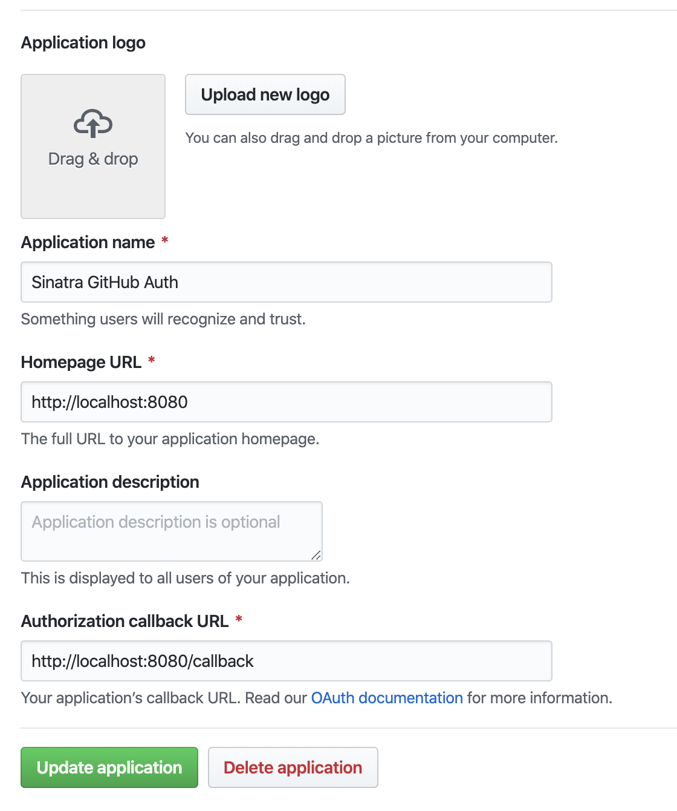

# GitHub Access Token

Following the guide on [github](https://developer.github.com/v3/guides/basics-of-authentication/), I created this project to get an access token to use with another test I was running locally.

I know there is also a way to do the OAuth request through Postman, but I wanted something to be able to share with my other team members who might need to do something similar in Ruby.

# Setup

1.  Create a [GitHub OAuth application](https://github.com/settings/applications/new)

    

2.  Enter your GitHub OAuth application `CLIENT_ID` and `CLIENT_SECRET` in your local `docker-compose.yml` **environments** section

    ```
    environment:
      - GH_BASIC_CLIENT_ID=[CLIENT_ID]
      - GH_BASIC_SECRET_ID=[CLIENT_SECRET]
    ```

3.  Start up the docker container

        docker-compose up

# Usage

1. Open http://localhost:8080 and click on the `Click here` link

   

2. GitHub will ask for permissions between your GitHub account and your Oauth application.

3. Your `access_token` should now be displayed on the page

   

# Clean Up

To remove the docker container, network, volume run the following:

```bash
docker-compose rm -sv
```

Lastly, to remove the docker image run:

```
docker rmi $(docker images | grep github-api_ruby | awk '{ print $3 }')
```
